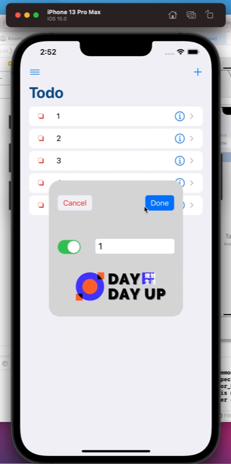

# IOSwork2 - TodoList

#### 环境：macOS BIG SUR 11.6

#### Xcode版本：Version 13.0 (13A233)

#### 模拟器：iphone13 pro max (ios15.0)

## 效果展示

#### 竖屏：

### 演示：B站 BV1GQ4y1q7xH

### 开发历程记录

+ 首先使用plain风格做出了一版Todo界面，但是对比了平时使用的TodoList，感觉还是圆角矩形化的Cell看着更加舒适。网络上搜索了一段时间还是不太了解别人是怎么实现这个界面的，于是采用了笨方法——直接把Cell类型设置成inset Group，然后每个Cell是一节，每节自然就一行。笨方法为后面的开发埋了点小坑。但是最后做出来的界面还是不错的。
+ 其次还是外观的设计，个人觉得pop一个View出来有点繁杂了，便将弹出来的View一番笨方法弄成了卡片视图。界面和配色还算是过得去。
+ 然后根据给出的网址实现了List项的更新和左右删除，然后根据文件里自带的Move重载实现了Cell的拖排。
+ App的图标竟然需要重启模拟器才能装载上，折腾了我好久结果在回宿舍路上看到一个人向Apple报告ios15好像存在相关问题才了解

### 感想

- 可能是平时使用别人的成熟App习惯了，自己在设计的时候执着于实现一些很美观的功能——比如打钩动画，真正的卡片list，长按拖动等。但是在经过几个小时的搜索，只找到一些swift2甚至OC代码，才了解到自己本身对各个接口、代理等所知也甚少，想一口气吃成胖子还是太困难了。
- Apple给出的接口确实挺多而且挺直观的，刚开始有些想找的api查了挺久不知道它是啥，结果把它的功能在Xcode编辑区打出来后竟然有了提示。但是还是想吐槽一下，不知道是apple更新快还是什么原因，网上搜索总是只能找到16-18年这样的文章，里面的代码实现感觉借鉴起来有点困难……
